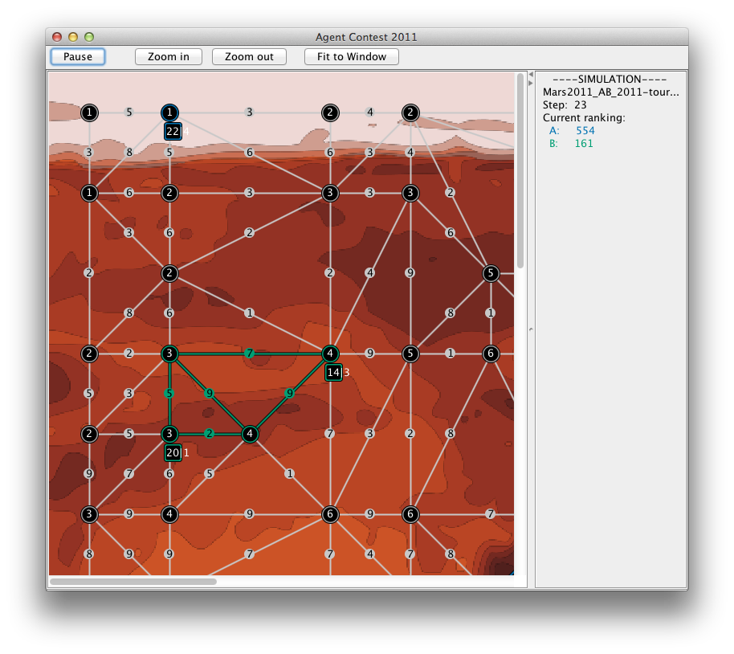

# The Multi-Agent Programming Contest *Agents on Mars* Scenario



The Agents on Mars scenario that is used in the [MAPC](https://multiagentcontest.org/) competition from 2011-2014. This is the version used in 2011 that allows agents to connect to the simulator using the EIS interface. 


Usage
=====

 * Unzip the ```downloads/massim-2011-1.0.2-bin.zip``` in a convenient place <MASSIM>
 
 * start the server
  * open a terminal and go to the <MASSIM>/massim/scripts directory
  * run the startServer.sh script
  * type ```0``` and press enter (once). This selects but does not yet start the tournament
 
 * start the viewer
    * open a terminal and go to the <MASSIM>/massim/scripts directory
   * run the startMarsMonitor.sh script
  
 * run the MAS
  * start GOAL (eg, SimpleIDE)
  * open the src/main/GOAL/mapc.mas2g
  * run the mas
  * switch to the server terminal window
  * press enter to start the tournament
  * press run in GOAL a few more times if new agents enter the scene in paused mode.
 